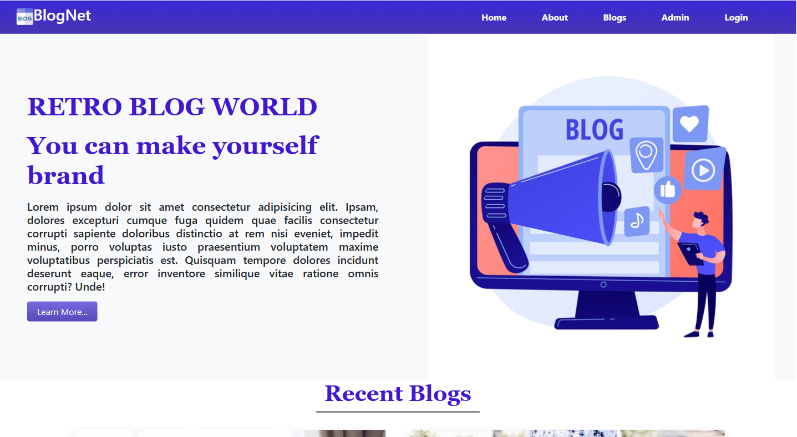

# BlogNet

# Features 
- Complete web application with a dynamic blog post and admin panel.
- User can read blog and also can comment on the blog.
- Admin can post and delete blog as per need.
- Custom Authentication & netlify hosting are also included. 
- use default admin access with email test@test.com and #2021dev.

# Technology
- HTML5
- CSS3
- Bootstrap5
- JavaScript
- React 
- Node JS
- Express JS
- MongoDB

###  `Demo Video Link :` [Demo](https://youtu.be/jIFSBbCjdwk)
###  `Website Link :` [Live Site](https://blognet370.netlify.app/)
###  `Server Repo Link :` [Github](https://github.com/naeemmahmud70/retro-blog-server)